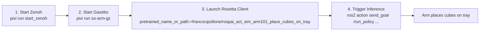

# Try a Pre-trained Policy in Simulation

<p align="center">
  
</p>

This guide lets you skip the slow **Record → Train → Deploy** loop and run a working policy end-to-end in Gazebo in a few minutes. We provide:

- **Pre-recorded rosbags** of pick-and-place demonstrations captured in the Gazebo `pai_world` scene.
- A **converted LeRobot dataset** on the HuggingFace Hub.
- A **trained ACT policy** on the HuggingFace Hub — ready to deploy via the Rosetta client.

The task is **place cubes on tray**: the SO-ARM101 picks up three cubes of different sizes sitting on the table and places them onto a tray.

```
  ┌──────────────┐     ┌───────────────────┐     ┌─────────────────┐
  │ PRE-RECORDED │     │  HUGGINGFACE HUB  │     │  DEPLOY POLICY  │
  │    ROSBAGS   │────▶│  dataset + model  │────▶│  in Gazebo sim  │
  └──────────────┘     └───────────────────┘     └─────────────────┘
```

> [!TIP]
> This is the **fastest** way to see the full pipeline in action. If you want to record your own demonstrations and train a policy from scratch, see the [End-to-End Learning Pipeline](end-to-end-pipeline.md) guide.

## The Pre-recorded Assets

| Asset                  | Where                                                                                                                                            | What it is                                                           |
| ---------------------- | ------------------------------------------------------------------------------------------------------------------------------------------------ | -------------------------------------------------------------------- |
| **Raw rosbags**        | [Google Drive folder](https://drive.google.com/drive/folders/1x-vtJqVtTHESkQLZCpj7aSnfekpI3YN4?usp=drive_link)                                   | MCAP rosbags captured in Gazebo via the Rosetta episode recorder     |
| **LeRobot dataset**    | [`francocipollone/rospai_sim_arm101_place_cubes_on_tray`](https://huggingface.co/datasets/francocipollone/rospai_sim_arm101_place_cubes_on_tray) | The rosbags above converted to a LeRobot v3.0 dataset (≈389 MB)      |
| **Trained ACT policy** | [`francocipollone/rospai_act_sim_arm101_place_cubes_on_tray`](https://huggingface.co/francocipollone/rospai_act_sim_arm101_place_cubes_on_tray)  | ACT model (51.7M params) trained on the dataset, ready for inference |

> [!NOTE]
> All three assets share the same task description: **`place cubes on tray`**.

### Dataset Structure

The LeRobot dataset contains:

- **60 episodes**, **80,421 frames** at **50 fps**
  - Note: The number of episodes might increase in the future.
- 1 task: `place cubes on tray`
- Robot type: `so_arm101`
- License: `apache-2.0`
- Features (matching the [SO-ARM101 contract](../../pai_data_collection_rosseta/config/rosetta/so_arm101.yaml)):

  | Feature                     | Type    | Shape     | Notes                                               |
  | --------------------------- | ------- | --------- | --------------------------------------------------- |
  | `observation.images.wrist`  | video   | 480×480×3 | Wrist-mounted camera, AV1 at 50 fps                 |
  | `observation.images.static` | video   | 480×480×3 | Static overhead camera, AV1 at 50 fps               |
  | `observation.state`         | float64 | 6         | Joint positions in **degrees** (contract `rad2deg`) |
  | `action`                    | float64 | 6         | Joint commands in **degrees** (contract `rad2deg`)  |

You can browse the episodes frame-by-frame in the [HuggingFace dataset viewer](https://huggingface.co/datasets/francocipollone/rospai_sim_arm101_place_cubes_on_tray/viewer/default/train) or open them in [LeRobot's online visualizer](https://huggingface.co/spaces/lerobot/visualize_dataset?path=francocipollone%2Frospai_sim_arm101_place_cubes_on_tray).

### Policy Details

The pretrained policy is an **ACT** ([Action Chunking with Transformers](https://huggingface.co/papers/2304.13705)) behavior-cloning model — the same architecture you would train by following the [End-to-End Learning Pipeline](end-to-end-pipeline.md) guide, ready to deploy via the [Rosetta client](end-to-end-pipeline.md#6-deploying-a-policy).

## Prerequisites

Follow the main [README](../../README.md) to set up the workspace (Pixi install + `pixi run build`). You will also need:

- An **NVIDIA GPU** — `policy_device:=cuda` requires CUDA to run inference. Switch to `cpu` if you don't have one (inference will be slower).
- **Internet access** — the pretrained model is fetched from the HuggingFace Hub on first launch and cached under `~/.cache/huggingface/`.

> [!IMPORTANT]
> This project uses `rmw_zenoh` as the ROS 2 middleware. The Zenoh router must be
> running before launching any demo. Start it in a dedicated terminal and leave it
> running for the duration of your session:
>
> ```bash
> pixi run start_zenoh
> ```
>
> See [Running the Robot](../running-the-robot.md) for details.

> [!NOTE]
> All commands below assume you are inside a `pixi shell` session or running via `pixi run`.

---

## Deploy the Pre-trained Policy

The fastest path to seeing the policy in action is to skip the rosbags and dataset entirely and load the model directly from the HuggingFace Hub.



### Step 1 — Start Gazebo Simulation

In a second terminal:

```bash
pixi run so-arm-gz
```

Wait for the simulation to fully come up — Gazebo window visible, robot settled in its home pose, and the three cubes (`cube_small`, `cube_medium`, `cube_large`) sitting on the table.

### Step 2 — Launch the Rosetta Client

In a third terminal, launch `rosetta_client_node` pointing at the pretrained checkpoint on the Hub:

```bash
pixi shell
```

```bash
ros2 launch rosetta rosetta_client_launch.py \
    contract_path:=$(ros2 pkg prefix pai_data_collection_rosseta)/share/pai_data_collection_rosseta/config/rosetta/so_arm101.yaml \
    pretrained_name_or_path:=francocipollone/rospai_act_sim_arm101_place_cubes_on_tray \
    policy_type:=act \
    policy_device:=cuda \
    use_sim_time:=true
```

Key flags:

| Flag                                                                                 | Why                                                                                          |
| ------------------------------------------------------------------------------------ | -------------------------------------------------------------------------------------------- |
| `pretrained_name_or_path:=francocipollone/rospai_act_sim_arm101_place_cubes_on_tray` | HuggingFace repo ID — Rosetta downloads and loads the checkpoint via LeRobot on first launch |
| `policy_type:=act`                                                                   | Must match the architecture of the checkpoint                                                |
| `policy_device:=cuda`                                                                | Use the GPU for inference. Use `cpu` if you don't have one                                   |
| `use_sim_time:=true`                                                                 | Required because Gazebo publishes its clock on `/clock` (instead of using wall-clock time)   |

The first launch will download the model weights into your local HuggingFace cache (`~/.cache/huggingface/`). Subsequent launches are instant.

> [!TIP]
> See the [Rosetta Client Parameters](end-to-end-pipeline.md#rosetta-client-parameters) table for the full set of launch arguments (`actions_per_chunk`, `server_address`, `launch_local_server`, etc.).

### Step 3 — Trigger Inference

In a fourth terminal, send a `RunPolicy` action goal with the task prompt used during recording:

```bash
pixi shell
```

```bash
ros2 action send_goal /run_policy \
    rosetta_interfaces/action/RunPolicy "{prompt: 'place cubes on tray'}"
```

The arm should start reaching for the cubes and placing them onto the tray. Inference runs continuously until the action goal is cancelled (e.g. `Ctrl+C` on the `ros2 action send_goal` command).

---

## Reset the Cubes and Run Again

Once the cubes are placed, the scene stays as-is. To run the policy again, reset the cubes' positions using the [`gz_set_cubes_poses.py`](../../pai_data_collection_rosseta/README.md#workflow) helper:

```bash
# Reset to the nominal starting layout.
pixi run ./pai_data_collection_rosseta/scripts/gz_set_cubes_poses.py

# Or randomize the cube poses within a small region around the nominal.
pixi run ./pai_data_collection_rosseta/scripts/gz_set_cubes_poses.py --random
```

> [!TIP]
> Pass `--random --seed <N>` for reproducible randomized layouts, or `--random --radius <r> --angle-range <deg>` to widen the variation. Run with `--help` for all options.

Then send another `RunPolicy` goal:

```bash
ros2 action send_goal /run_policy \
    rosetta_interfaces/action/RunPolicy "{prompt: 'place cubes on tray'}"
```

---

## Inspect the Pre-recorded Assets (Optional)

If you want to dig deeper than just running the model, here are a few ways to inspect the assets directly.

### Browse the Dataset

The [HuggingFace dataset viewer](https://huggingface.co/datasets/francocipollone/rospai_sim_arm101_place_cubes_on_tray/viewer/default/train) lets you scrub through all episodes, inspect joint trajectories, and watch the wrist / static camera feeds without downloading anything.

### Replay the Rosbags

Download the [rosbag folder](https://drive.google.com/drive/folders/1x-vtJqVtTHESkQLZCpj7aSnfekpI3YN4?usp=drive_link) and replay individual episodes with `ros2 bag play`. With Gazebo still running, the robot will reproduce the demonstration — a quick way to spot bad episodes. See [Verifying a Recorded Episode](end-to-end-pipeline.md#verifying-a-recorded-episode) for details.

### Convert the Rosbags Yourself

If you want to see the full Record → Convert path without the recording step, you can re-run the conversion from the downloaded rosbags. See [Converting to LeRobot Dataset](end-to-end-pipeline.md#3-converting-to-lerobot-dataset) — just point `--raw-dir` at the directory of rosbags you downloaded and use the SO-ARM101 contract.

---

## Next Steps

Once you've seen the pretrained policy in action, you can take it further:

- **Train your own policy** — record new demonstrations via [leader arm teleoperation](../teleoperation.md) or any other input method, convert them to a LeRobot dataset, and train a policy. See the [End-to-End Learning Pipeline](end-to-end-pipeline.md) guide.
- **Try on real hardware** — swap `pixi run so-arm-gz` for `pixi run so-arm-real` and load the same checkpoint. Note that policies trained in simulation rarely transfer to the real robot without additional demonstrations — you'll likely need to collect a few real-world episodes and fine-tune.
- **Try other policies** — the pipeline supports any LeRobot policy (`smolvla`, `diffusion`, `pi0`, `pi0fast`). The HuggingFace dataset above is compatible with all of them.
