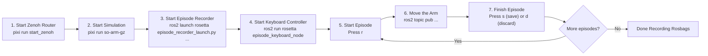

# pai_data_collection_rosseta

Data collection tools for Physical AI demos using [rosetta](https://github.com/iblnkn/rosetta).

## Requirements

This project uses [Pixi](https://pixi.sh/) for environment management. Make sure the workspace is set up following the [Development Guide](../docs/development.md).

The required external repos (`rosetta` and `rosetta_interfaces`) are included in `pai.repos` and will be fetched automatically during workspace setup:

```bash
vcs import external < pai.repos --recursive
```

> [!NOTE]
> The following commands assume you are inside a `pixi shell` session or that you are running via `pixi run`.
> See the [Development Guide](../docs/development.md) for details.

## Recording Rosbag

This package provides a rosetta contract for the SO-ARM101 robot (`config/rosetta/so_arm101.yaml`).
Recording uses rosetta's `episode_recorder_launch.py` directly.

### Workflow

1. Run zenoh router on a separate terminal:

```bash
pixi run start_zenoh # ros2 run rmw_zenoh_cpp rmw_zenohd
```

2. Start simulation:

```bash
pixi run so-arm-gz # ros2 launch pai_bringup so_arm_gz_bringup.launch.py
```

3. Start the episode recorder (using rosetta's launch file with our contract):

```bash
ros2 launch rosetta episode_recorder_launch.py \
    contract_path:=$(ros2 pkg prefix pai_data_collection_rosseta)/share/pai_data_collection_rosseta/config/rosetta/so_arm101.yaml \
    bag_base_dir:=datasets/so_arm101/bags
```

4. Start the keyboard controller (in a new terminal):

```bash
ros2 run rosetta episode_keyboard_node
```

Press `t` to set a task prompt, then `r` (or `→`) to start recording.

5. Reset the cubes (Gazebo only, before each episode):

The cubes do not snap back to their starting poses when an episode ends, so reset them before recording the next one. The script lives in this package and is installed automatically by `pixi run build`:

```bash
# Reset to the nominal layout (matches the starting layout in so_arm_table.sdf)
$(ros2 pkg prefix pai_data_collection_rosseta)/share/pai_data_collection_rosseta/scripts/gz_set_cubes_poses.py

# Or randomize the pose of each cube within a small region around the nominal
$(ros2 pkg prefix pai_data_collection_rosseta)/share/pai_data_collection_rosseta/scripts/gz_set_cubes_poses.py --random --seed 1
```

Run with `--help` to see all options (`--radius`, `--angle-range`, `--pose NAME=...` overrides, `--dry-run`).

6. Move the arm:

You can directly use the forward position controller via topic:

```bash
# Home position (all zeros)
ros2 topic pub /forward_position_controller/commands std_msgs/msg/Float64MultiArray '{layout: {dim: [{label: joint, size: 6, stride: 1}]}, data: [0.0, 0.0, 0.0, 0.0, 0.0, 0.0]}' --rate 20

# Slight rotation and tilt
ros2 topic pub /forward_position_controller/commands std_msgs/msg/Float64MultiArray '{layout: {dim: [{label: joint, size: 6, stride: 1}]}, data: [0.2, -0.4, 0.0, 0.0, 0.0, 0.4]}' --rate 20
```

There is simple script to run some of these commands sequentially:

```bash
$(ros2 pkg prefix pai_data_collection_rosseta)/share/pai_data_collection_rosseta/scripts/arm_demo_positions.sh
```

7. Finish episode: Press `s` (or `←`) to stop and save, or `d` to discard.

This will save a rosbag that corresponds to that episode.

8. Record more episodes: Repeat from step 5 (press `r` again — no need to restart the keyboard controller; reset the cubes to start fresh).

#### Workflow Overview



### MuJoCo-based data collection

Use MuJoCo simulation with the same `so_arm101.yaml` contract.

1. Start zenoh router: `pixi run start_zenoh`
2. Start MuJoCo + camera relay: `pixi run so-arm-mujoco`
3. Start rosetta recorder: `pixi run rosetta-record-mujoco`
4. Start keyboard controller (new terminal): `ros2 run rosetta episode_keyboard_node`
5. Press `t` to set a prompt, `r` to start recording
6. Move the arm: `$(ros2 pkg prefix pai_data_collection_rosseta)/share/pai_data_collection_rosseta/scripts/arm_demo_positions.sh` (or `ros2 topic pub`; MuJoCo must already be running from step 2)
7. Press `s` to save or `d` to discard the episode

## Convert Rosbag to LeRobot

The contract (`so_arm101.yaml`) specifies `unit_conversion: rad2deg` in the action's `from_tensor` section, which automatically converts ROS radians to LeRobot degrees during conversion.

```yaml
# In the contract (config/rosetta/so_arm101.yaml):
actions:
  - key: action
    ...
    from_tensor:
      clamp: [-3.14159, 3.14159]
      unit_conversion: rad2deg  # Converts radians → degrees for LeRobot
```

Run conversion (Gazebo bags use `datasets/so_arm101/bags`; MuJoCo bags use `datasets/so_arm101_mujoco/bags`):

```bash
# Gazebo
python -m rosetta.port_bags \
    --raw-dir datasets/so_arm101/bags \
    --contract $(ros2 pkg prefix pai_data_collection_rosseta)/share/pai_data_collection_rosseta/config/rosetta/so_arm101.yaml \
    --repo-id move_arm \
    --root datasets_lerobot

# MuJoCo
python -m rosetta.port_bags \
    --raw-dir datasets/so_arm101_mujoco/bags \
    --contract $(ros2 pkg prefix pai_data_collection_rosseta)/share/pai_data_collection_rosseta/config/rosetta/so_arm101.yaml \
    --repo-id move_arm_mujoco \
    --root datasets_lerobot
```

### port_bags arguments

| Argument        | Required | Description                                                           |
| --------------- | -------- | --------------------------------------------------------------------- |
| `--raw-dir`     | Yes      | Directory containing bag subdirectories (each with `metadata.yaml`)   |
| `--contract`    | Yes      | Path to rosetta contract YAML                                         |
| `--repo-id`     | No       | Dataset name. Defaults to `--raw-dir` directory name                  |
| `--root`        | No       | Parent directory for datasets. Dataset saved to `root/repo-id`        |
| `--push-to-hub` | No       | Upload to HuggingFace Hub after conversion                            |
| `--vcodec`      | No       | Video codec (default: `libsvtav1`). Use `libx264` for faster encoding |

## Replay Dataset on Real Robot using LeRobot

Using local LeRobot dataset (from within the pixi environment):

```bash
lerobot-replay \
    --robot.type=so101_follower \
    --robot.port=/dev/so101_follower \
    --robot.id=my_awesome_arm \
    --dataset.repo_id=move_arm \
    --dataset.root=datasets_lerobot/move_arm \
    --dataset.episode=0 \
    --robot.use_degrees=true \
    --play_sounds=false
```

**Important flags:**

- `--robot.use_degrees=true` - Required because the dataset contains degree values (from `unit_conversion: rad2deg` in the contract)
- `--play_sounds=false` - Disable audio feedback (avoids `spd-say` errors)
